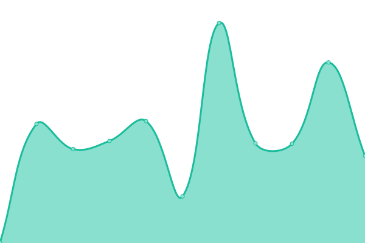
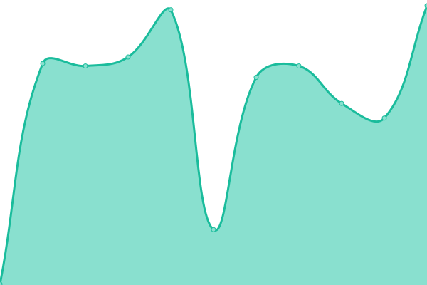
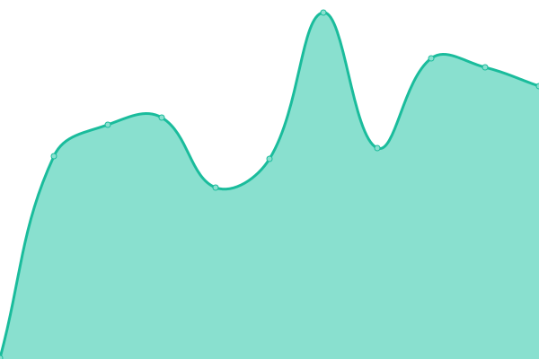

# [📈 Live Status](https://qoreHQ.github.io/uptime): <!--live status--> **🟩 All systems operational**

This repository contains the open-source uptime monitor and status page for [qore](https://qore.no), powered by [Upptime](https://github.com/upptime/upptime).

With [Upptime](https://upptime.js.org), you can get your own unlimited and free uptime monitor and status page, powered entirely by a GitHub repository. We use [Issues](https://github.com/qoreHQ/uptime/issues) as incident reports, [Actions](https://github.com/qoreHQ/uptime/actions) as uptime monitors, and [Pages](https://qoreHQ.github.io/uptime) for the status page.

<!--start: status pages-->
<!-- This summary is generated by Upptime (https://github.com/upptime/upptime) -->
<!-- Do not edit this manually, your changes will be overwritten -->
<!-- prettier-ignore -->
| URL | Status | History | Response Time | Uptime |
| --- | ------ | ------- | ------------- | ------ |
|  [qore.no](https://qore.no) | 🟩 Up | [qore-no.yml](https://github.com/qoreHQ/uptime/commits/HEAD/history/qore-no.yml) | 

 333ms
     
 | 

<a href="https://qoreHQ.github.io/uptime/history/qore-no">95.06%</a>
    

|  [git.qore.no](https://git.qore.no) | 🟩 Up | [git-qore-no.yml](https://github.com/qoreHQ/uptime/commits/HEAD/history/git-qore-no.yml) | 

 314ms
     
 | 

<a href="https://qoreHQ.github.io/uptime/history/git-qore-no">95.08%</a>
    

|  [beta.qore.no](https://beta.qore.no) | 🟩 Up | [beta-qore-no.yml](https://github.com/qoreHQ/uptime/commits/HEAD/history/beta-qore-no.yml) | 

 302ms
     
 | 

<a href="https://qoreHQ.github.io/uptime/history/beta-qore-no">95.09%</a>
    

|  [db.qore.no](https://db.qore.no) | 🟩 Up | [db-qore-no.yml](https://github.com/qoreHQ/uptime/commits/HEAD/history/db-qore-no.yml) | 

 301ms
     
 | 

<a href="https://qoreHQ.github.io/uptime/history/db-qore-no">95.11%</a>
    

|  [248.no](https://248.no) | 🟩 Up | [248-no.yml](https://github.com/qoreHQ/uptime/commits/HEAD/history/248-no.yml) | 

 293ms
     
 | 

<a href="https://qoreHQ.github.io/uptime/history/248-no">95.12%</a>
    

|  [actingquiet.com](https://actingquiet.com) | 🟩 Up | [actingquiet-com.yml](https://github.com/qoreHQ/uptime/commits/HEAD/history/actingquiet-com.yml) | 

 309ms
     
 | 

<a href="https://qoreHQ.github.io/uptime/history/actingquiet-com">95.13%</a>
    

|  [vagn.es](https://vagn.es) | 🟩 Up | [vagn-es.yml](https://github.com/qoreHQ/uptime/commits/HEAD/history/vagn-es.yml) | 

 220ms
     
 | 

<a href="https://qoreHQ.github.io/uptime/history/vagn-es">95.15%</a>
    

|  [rosvik.no](https://rosvik.no) | 🟩 Up | [rosvik-no.yml](https://github.com/qoreHQ/uptime/commits/HEAD/history/rosvik-no.yml) | 

 2252ms
     
 | 

<a href="https://qoreHQ.github.io/uptime/history/rosvik-no">95.39%</a>
    

<!--end: status pages-->

[**Visit our status website →**](https://qoreHQ.github.io/uptime)

## 📄 License

- Powered by: [Upptime](https://github.com/upptime/upptime)
- Code: [MIT](./LICENSE) © [qore](https://qore.no)
- Data in the `./history` directory: [Open Database License](https://opendatacommons.org/licenses/odbl/1-0/)
